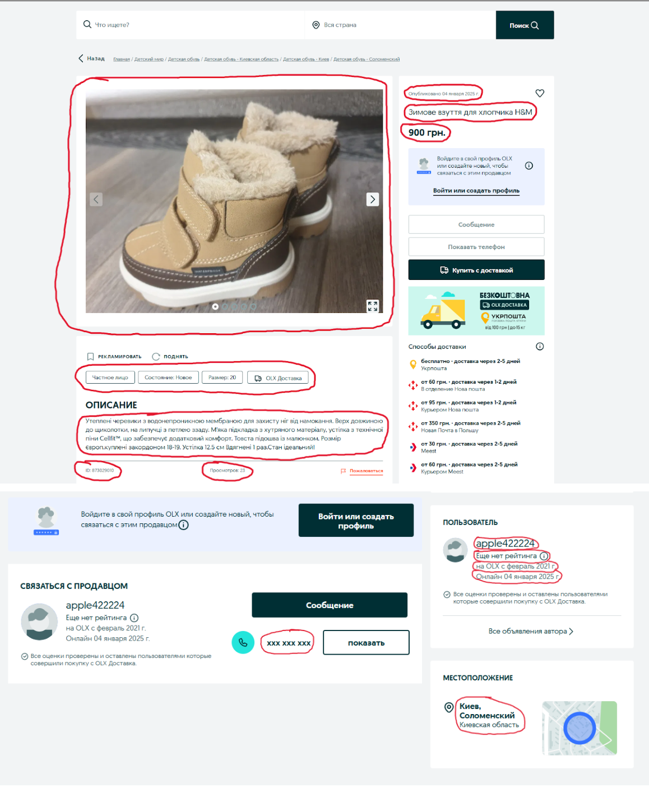

# Тестове завдання для DataOx
- Створіть файл `.env` в корені вашого проєкту та заповніть його за зразком `example.env`.

- Інструкції по запуску:
1. Запустіть Docker:
      ```bash
      docker-compose up -d
      ```

2. Встановіть залежності:
      ```bash
      pip install -r requirements.txt
      ```

3. Завантажте браузери для **Playwright** (обов'язковий крок):
      ```bash
      playwright install
      ```
4. Застосуйте міграції:
     ```bash
     alembic upgrade head
     ```

5. Запустіть сервер:
      ```bash
      py main.py
      ```

## Бизнес задача
- Необходимо создать программу для периодического скрапинга платформы OLX (ссылка на стартовую страницу, которую можно внести хардкодом https://www.olx.ua/uk/list/).

## Обязательные требования к программе:
1. Программа должна запускаться каждую минуту.
2. Собирать необходимо только первые 5 страниц.
3. База данных для хранения - PostgreSQL.
4. Структура базы данных - на усмотрение кандидата.
5. В базе данных не должно быть дубликатов (информацию обновлять не нужно).
6. Выбор подхода скрапинга - на усмотрение кандидата.
7. Выбор библиотек или сервисов для скрапинга - на усмотрение кандидата.
8. Программа должна делать ежедневные дампы базы данных в 12:00 по киевской тайм-зоне и сохранять их в папку “dumps” рядом с приложением.
9. Программа должна иметь систему логирования (5 файлов по 1 ГБ).
10. Программа и база данных разворачиваются с помощью docker-compose

## Примечания:
- На картинках ниже указаны поля для скрапинга (+ URL самого товара, который не показан на картинках).
- Типы полей в базе данных кандидат определяет на свое усмотрение.
- Картинки товаров скачивать не нужно, достаточно только собрать все ссылки на них.
- Номер телефона собирается по возможности, так как не везде он доступен без регистрации.

## Screenshot
